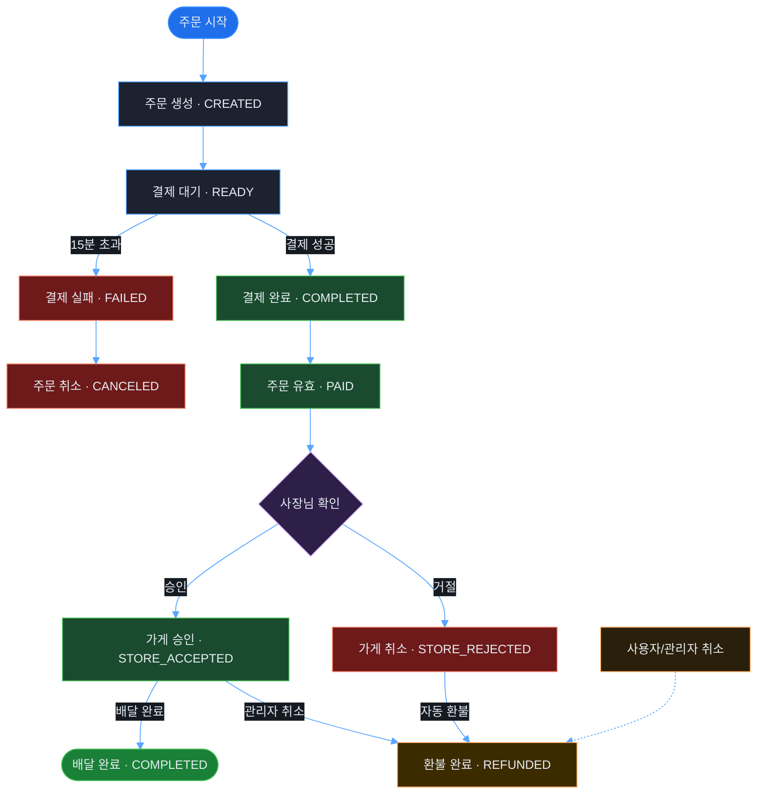
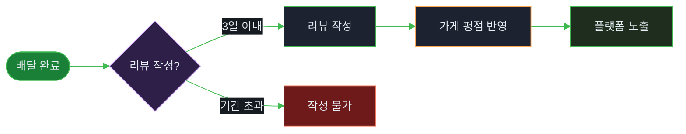
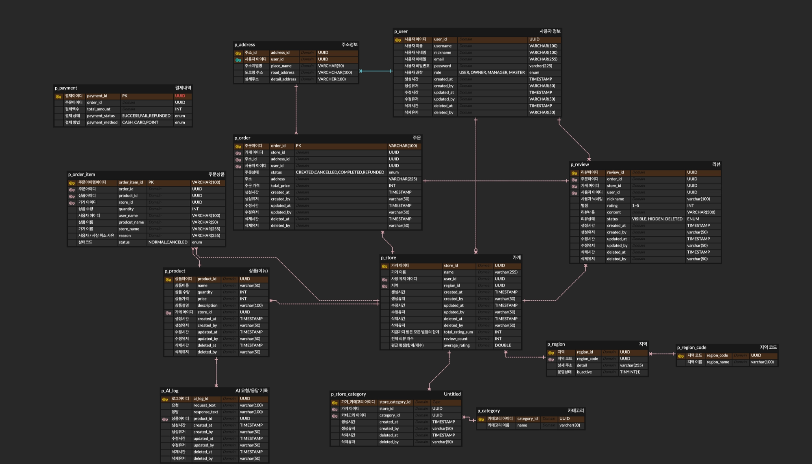

# food-order-platform
### AI 를 활용한 배달 플랫폼 개발 ###  
[내일배움캠프 Spring 단기심화] 입문 프로젝트-음식 주문 관리 플랫폼

## "주문의 패러다임을 바꾸다: AI와 함께하는 스마트 푸드 딜리버리 플랫폼"
비대면 소비 문화의 확산과 모바일 기반 주문 서비스의 성장으로 배달 서비스 시장이 빠르게 확대되고 있다. 특히 음식 주문부터 결제, 배송 상태 확인까지 전 과정을 모바일에서 처리하는 서비스가 보편화되면서, 사용자들은 더욱 편리하고 직관적인 주문 경험을 요구하고 있다.

이에 따라 본 프로젝트는 배달 서비스의 기본 흐름을 이해하고 구현하는 것을 목표로, 사용자 친화적인 배달 주문 프로그램을 설계·개발하고자 한다.


<a id="toc"></a>
## 목차 ##
- [팀원 소개](#team)
- [아키텍처 흐름](#architecture-flow)
- [ERD](#erd)
- [기술 스택](#tech-stack)
- [주요 기능](#features)
- [패키지 구조](#package-structure)
- [API 개요](#api-overview)
- [로컬 실행](#local-run)
- [Docker로 빌드/실행](#docker-run)

<a id="team"></a>
## 팀원 소개 ##
 <h3>

<a href="https://github.com/booungyi"></a>  **문인혁** (리더)
- 주문/ 결제

<a href="https://github.com/kimjuneon"></a>  **김준언** (부리더)
- 가게 / 상품

<a href="https://github.com/zlonce"></a>  **김지원** (팀원)
- AI

<a href="https://github.com/sionkim0126"></a>  **김시온** (팀원)
- 인증/보안

<a href="https://github.com/LSLight"></a>  **이수빈** (팀원)
- 리뷰 / 평점

<a href="https://github.com/rlaxxwls13"></a> **김하진** (팀원)
- CI / CD

</h3>

<a id="architecture-flow"></a>
## 아키텍처 흐름

### 1. 주문-결제 라이프사이클 (Order & Payment)



### 2. 서비스 부가 기능 (Review & AI Helper)

#### 리뷰 시스템 (Review System)



#### AI 상품 설명 생성 (AI Helper)


<a id="erd"></a>
## ️ ERD


<a id="tech-stack"></a>
## 🛠 기술 스택
- **Build/Tooling**
  - Gradle
  - Java 17
- **Auth/Security**
  - Spring Security
  - JWT (jjwt)
- **Persistence**
  - Spring Data JPA
  - Hibernate
- **Docs**
  - springdoc-openapi (Swagger UI)
- **Test**
  - JUnit5
  - Mockito
  - AssertJ
- **Back**
  - Spring Boot 3.5.11
  - Java 17
- **DB**
  - PostgreSQL (JDBC Driver: `org.postgresql:postgresql`)
  - Docker (PostgreSQL on Docker)
- **AI**
  - Google AI Studio Gemini
- **Swagger**
  - Swagger UI: `http://localhost:8080/swagger-ui/index.html`

<a id="features"></a>
## 💡 주요 기능
- 회원가입/로그인(JWT) 및 토큰 재발급
- 가게 CRUD 및 검색/페이징(관리자용 포함)
- 상품 CRUD 및 검색/페이징, 숨김 처리(관리자용 포함)
- 주문 생성/조회/검색/취소(고객), 주문 조회/승인/거절/완료(사장), 주문 조회/강제취소(관리자)
- 결제 생성(READY)/완료/취소, 결제 검색/페이징(고객/사장/관리자)
- 리뷰 작성/수정/삭제 및 조회(고객/관리자)
- AI 설명 로그 조회/수정/삭제(권한 기반)

<a id="package-structure"></a>
## 패키지 구조
```text
공통 레이어 구조 (auth/user/store/product/order/payment/review)
├─ application
│  ├─ dto
│  └─ service
├─ domain
│  ├─ entity
│  └─ repository
└─ presentation
   ├─ controller
   └─ dto

src/main/java/nbcamp/food_order_platform
├─ global (common/config/error/security)
├─ auth        → 공통 레이어 구조
├─ user        → 공통 레이어 구조
├─ store       → 공통 레이어 구조
├─ product     → 공통 레이어 구조
├─ order       → 공통 레이어 구조
├─ payment     → 공통 레이어 구조
├─ review      → 공통 레이어 구조
├─ ai
│  ├─ client (request/response)
│  └─ application/domain/presentation (공통 레이어 구조와 유사)
├─ category
│  └─ domain (entity/respository)
└─ regionCode
   └─ domain (entity/repository)
```

<a id="api-overview"></a>
## API 개요
아래는 주요 API prefix 요약입니다.
- Auth: `/api/v1/auth`
- Users: `/api/v1/users`
- Stores: `/api/v1/stores`
- Products: `/api/v1/products`, `/api/v1/admin/products`
- Orders: `/api/v1/orders`, `/api/v1/owner/orders`, `/api/v1/admin/orders`
- Payments: `/api/v1/payments`, `/api/v1/owner/payments`, `/api/v1/admin/payments`
- Reviews: `/api/v1/reviews`, `/api/v1/admin/reviews`
- AI: `/api/v1/ai`

<a id="local-run"></a>
## 로컬 실행
### 1) PostgreSQL 실행 (Docker)
`docker-compose.yml`은 `db`(PostgreSQL)와 `app`(배포 이미지) 서비스를 포함합니다.
로컬 개발에서는 우선 DB만 실행하는 것을 권장합니다.

```bash
docker compose up -d db
```

`.env` 파일(프로젝트 루트)에 아래 값을 준비하세요.

```env
POSTGRES_DB=food_order
POSTGRES_USER=food_order
POSTGRES_PASSWORD=food_order
JWT_SECRET=change-me
GEMINI_API_KEY=change-me
```

### 2) 로컬 설정 파일 준비
로컬 전용 설정은 git에 커밋하지 않도록 `.gitignore`에 포함되어 있습니다.
- `src/main/resources/application-local.yml` (직접 생성)
- 템플릿: `src/main/resources/application-local.yml.example`

`application-local.yml.example`을 복사해 `application-local.yml`로 만들고, DB 계정 정보를 채워주세요.

로컬에서는 스키마 자동 반영이 필요하면 `ddl-auto: update`(템플릿 기본값)를 사용합니다.
(운영/공용 DB에는 `ddl-auto: none` 권장)

### 3) 애플리케이션 실행
```bash
./gradlew bootRun
```

프로파일은 IDE 또는 환경변수로 활성화할 수 있습니다.
```bash
# PowerShell 예시
$env:SPRING_PROFILES_ACTIVE="local"
./gradlew bootRun
```

<a id="docker-run"></a>
## 🐳 Docker로 빌드/실행(선택)
`Dockerfile`은 Gradle로 jar를 빌드한 뒤 `java -jar`로 실행합니다.

```bash
docker build -t food-order-platform:local .
docker run --rm -p 8080:8080 `
  -e SPRING_PROFILES_ACTIVE=prod `
  -e SPRING_DATASOURCE_URL=jdbc:postgresql://host.docker.internal:5432/$env:POSTGRES_DB `
  -e SPRING_DATASOURCE_USERNAME=$env:POSTGRES_USER `
  -e SPRING_DATASOURCE_PASSWORD=$env:POSTGRES_PASSWORD `
  -e JWT_SECRET=$env:JWT_SECRET `
  -e GEMINI_API_KEY=$env:GEMINI_API_KEY `
  food-order-platform:local
```